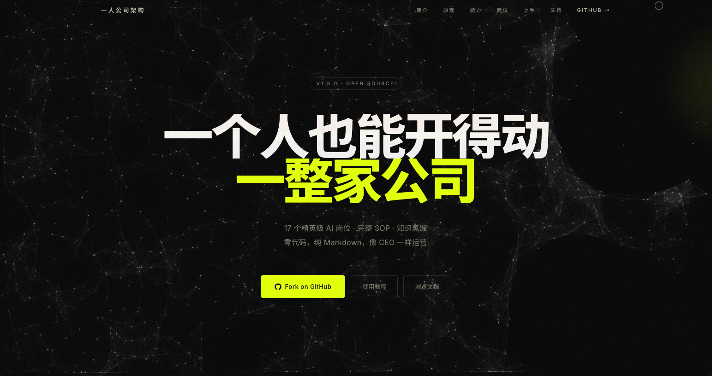

  

<h1 align="center">一人公司架构 · Solo Company</h1>

  <strong>DIRECT · DELIVER · EVOLVE</strong> 
  AI 驱动的一人公司操作系统

  
  &nbsp;
  

  
  

 

---

## ✨ 产品简介

**一人公司架构** 是一套专为**独立开发者、自由职业者和个人创业者**打造的 AI 驱动公司操作系统，当前版本 **v1.8.0**，完全开源。

它内置 **17 个精英级 AI 岗位**——涵盖产品经理、全栈工程师、UI 设计师、法务顾问、财务经理、增长经理等全职能角色，每个岗位配备：

- 📜 完整的 **SOP 流程**
- 📚 专业 **知识库**
- 📄 标准 **模板**
- 🎯 履历对标 **行业顶尖人物**

你只需像 CEO 一样发出一句指令："**多久内做一个什么项目**"，系统便自动完成：

1. 🩺 **智能分诊**
2. 🎚️ **档位判定**（⚡闪电 / 🚀标准 / 🏆精品）
3. 🧑‍💼 **岗位调度**
4. 📦 **5 层交付物生成**
5. ✅ **4 道 Reviewer 质量审核**
6. 🧠 **首席知识官（CKO）经验蒸馏回写**

整套系统**零代码门槛**，基于纯 Markdown 与 Claude Code 运行，兼容 Obsidian、GitHub 和 Vercel，**3 分钟即可上手**。

它不是 Prompt 集合，而是一套完整的**个人公司操作系统**——让一个人，真正开得动一整家公司。

 

## 🎬 产品截图

  
   
  <b>AI 驱动的一人公司操作系统</b>

 

## 🪐 立即体验

**🌐 官网体验：[itawjh.cn](https://itawjh.cn/)**

无需安装 · 网页直达

 

## 🛸 关于 Innate Labs

> **Building AI-native products & agents for the next generation of founders.**

[Innate Labs](https://github.com/Innate-Labs) 致力于打造下一代 AI 原生产品与智能体（Agents）。

- 🌐 GitHub：<https://github.com/Innate-Labs>
- 🪐 产品官网：<https://itawjh.cn/>

 

---

  
    © 2026 <a href="https://github.com/Innate-Labs"><b>Innate Labs</b></a> &nbsp;·&nbsp;
    Crafted with 🌊 and ✨ AI &nbsp;·&nbsp;
    <a href="https://itawjh.cn/">itawjh.cn</a>
  

